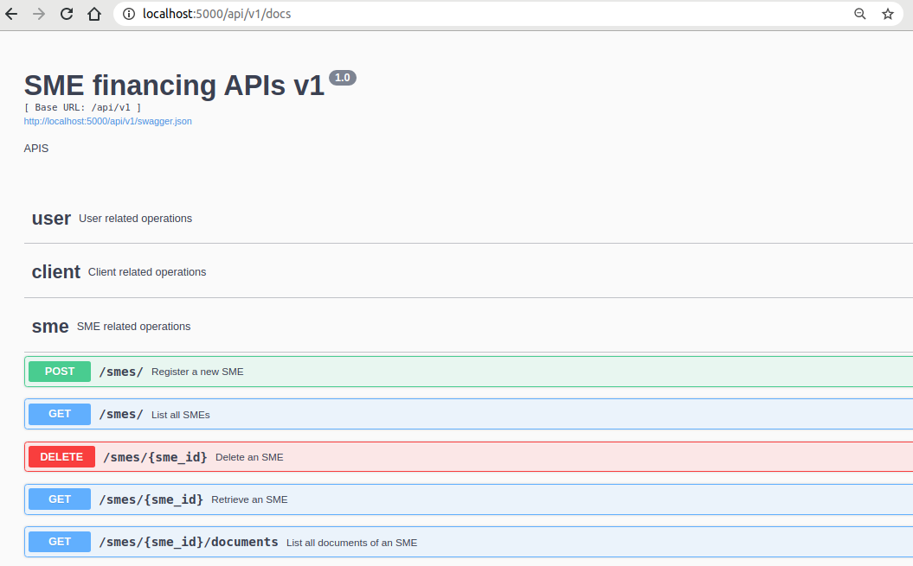

# SME financing platform (APIs)

[](https://img.shields.io/badge/Code%20Quality-D-red)

## About

We are building an SME financing platform solution that would help small and medium entreprises gain access to financial services and manage, track and ensure the effective implementation the financing project. This repo contains the backend part (APIs) of the project. The fontend is [here](https://github.com/BuildForSDG/.team-214).



<!-- Once this repo has been setup on Codacy by the TTL, replace the above badge with the actual one from the Codacy dashboard, and add the code coverage badge as well. This is mandatory -->

This project uses:

- poetry as a dependecy manager; configuration in pyproject.toml

- flake8: for linting
- black: for formatting
- pytest: for running tests

## Why

SMEs are a crucial contributor to industry in emerging markets, contributing up to 60% of total employment. However, 200 million SMEs lack access to affordable financial services and credit. When firms gain access to financial services such as credit and insurance, they can accumulate assets, expand their firms, make more productive investments and create jobs.

## Usage

How would someone use what you have built, include URLs to the deployed app, service e.t.c when you have it setup

## Setup

You should have **Python 3.7+** and **git** installed.

1. Clone the repo

```sh
git clone https://github.com/BuildForSDG/team-214-backend.git
```

&nbsp;
2. Change into repo directory

```sh
cd team-214-backend
```

&nbsp;
3. Install poetry, a dependecy manager for python.

On windows, you will need powershell to install it:

```sh
(Invoke-WebRequest -Uri https://raw.githubusercontent.com/python-poetry/poetry/master/get-poetry.py -UseBasicParsing).Content | python
```

After that you will need to restart the shell to make it operational.

On linux and other posix systems (mac included):

```sh
curl -sSL https://raw.githubusercontent.com/python-poetry/poetry/master/get-poetry.py | python
```

To check that it is correctly installed, you can check the version:

```sh
poetry --version
```

May be the latest stable version is not installed with the installation script, to update poetry, you can run:

```sh
poetry self update
```

&nbsp;
4. With poetry installed, you should install project dependecies by running:

```sh
poetry install
```

This will install all the dependencies found in `pyproject.toml`, that includes pytest for running tests and flake8, linter for the project.

&nbsp;
5. With the dependencies installed, you can start the project by running:

```sh
python manage.py run
```

### Additional commands

- Lint: `poetry run flake8`
- Run tests using the command: `poetry run pytest`
- Install dependencies:
  `poetry add <dependency>`
- Install dev dependencies:
  `poetry add --dev <dev-dependency>`

## Authors

List the team behind this project. Their names linked to their Github, LinkedIn, or Twitter accounts should siffice. Ok to signify the role they play in the project, including the TTL and mentor

## Contributing

If this project sounds interesting to you and you'd like to contribute, thank you!
First, you can send a mail to buildforsdg@andela.com to indicate your interest, why you'd like to support and what forms of support you can bring to the table, but here are areas we think we'd need the most help in this project :

1. area one (e.g this app is about human trafficking and you need feedback on your roadmap and feature list from the private sector / NGOs)

2. area two (e.g you want people to opt-in and try using your staging app at staging.project-name.com and report any bugs via a form)

3. area three (e.g here is the zoom link to our end-of sprint webinar, join and provide feedback as a stakeholder if you can)

## Acknowledgements

Did you use someone else’s code?
Do you want to thank someone explicitly?
Did someone’s blog post spark off a wonderful idea or give you a solution to nagging problem?

It's powerful to always give credit.

## LICENSE

MIT
